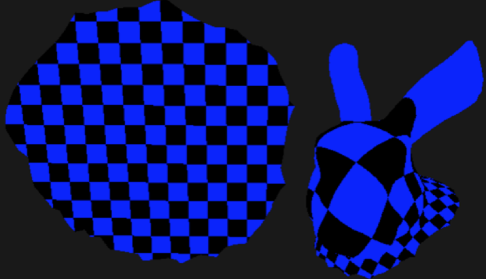

# Conformal Parameterization 
Parameterizing a triangle mesh means computing a one to one correspondence between a discrete, triangle surface patch and a planar mesh through a piecewise linear map. This amounts to assigning each triangle mesh vertex a pair of coordinates (u, v) indicating its position on the planar mesh. These planar coordinates are particularly useful for mapping textures on a 3D surface in addition to performing mesh operations such as surface fitting and remeshing.  

A consequence of trying to flatten a non flat triangulated surface from 3d to 2d is the introduction of distortions. While it is almost always impossible to flatten a surface isometrically, i.e., preserving both lengths and angles, it is possible to find an angle preserving or conformal parameterization. This repo implements several state of the art algorithms for conformal flattening such as LSCM, SCP, Circle Patterns, CETM. BFF is the most recent of these algorithms that provides additional flexibility with the resulting flattening. An implementation can be found [here](https://geometrycollective.github.io/boundary-first-flattening/).

Implements algorithms for conformal parameterization.

Usage: ./conformal-parameterization -run_test 0/1 -obj_path PATH -shader_path PATH 
